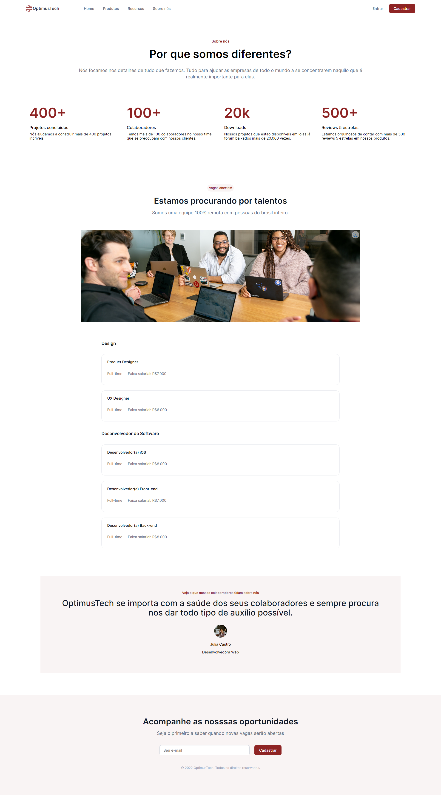

# site optimustech
 Site criado ao acompanhar o 7 days of code da formação HTML e CSS.

## Link Relacionado
### [🔗Acesso ao site](https://ngemir.github.io/site-optimustech/)
### [ Figma](https://www.figma.com/file/mm3MLozvUDGhDRTxSLlGL5/7daysOfCode-HTML-CSS?node-id=0%3A9878)
## O que é 7 days of code da Alura?
É um desafio que é feito para os alunos da Alura quando finaliza alguma formação. É feito um desafio nos 7 dias para concluir o objetivo definido para botar em prática o que foi ensinado durante o estudo da formação.

### Como foi solicitado o desafio?
Como a formação finalizada é de HTML e CSS, me foi solicitado para que criasse um site no seguinte escopo: `uma empresa de TI quer desenvolver uma página destinada a novas contratações e contratou você para desenvolvê-la.`

E tive que acessar o seguinte layout no figma : https://www.figma.com/file/mm3MLozvUDGhDRTxSLlGL5/7daysOfCode-HTML-CSS?node-id=0%3A9878 

Seguindo o layout só precisava criar o site de acordo utilizando tecnicas que aprendeu no estudo. E o tempo do desafio é de 7 dias.

## Quem solicitou o desafio?
Desafio solicitado por Giovanna Moeller 
